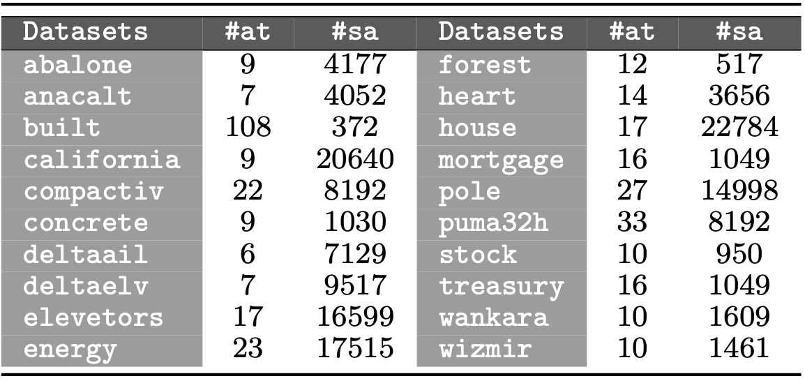

 

This web-page contains complementary material to the research paper:

| | |
|:---|:---|
||Juan Martín, José A. Sáez, Emilio Corchado. **On the regressand noise problem: model robustness and synergy with regression-adapted noise filters**. [IEEE Access](https://ieeeaccess.ieee.org/), 2021 (submitted).|
| | |

 

The web is organized according to the following summary:

1. [Abstract](#Abstract)
2. [Real-world datasets](#Datasets)
3. [Performance results](#Performance)

 
 
##  1. Abstract
This research focuses on analyzing the robustness of different regression paradigms under regressand noise, which has not been examined in depth in the specialized literature. Furthermore, their synergy with fourteen noise preprocessing techniques adapted from the field of classification, known as noise filters, is studied. In order to do this, several noise levels are injected into the output variable of 20 real-world datasets. They are used to evaluate the performance of each regression algorithm with and without the employment of noise filters. The results obtained allow building a robustness ranking of the regression methods to regressand noise. This provides interesting findings, such as some learning paradigms change their well-know behaviour with noise in classification problems when they are applied to regression data. On the other hand, the usage of noise filters improves the performance of regression methods, showing different synergies depending on the regression paradigm and filter employed. 

 
 
##  2. Real-world datasets
This research considers 20 different regression datasets taken from the *UCI machine learning* and *KEEL-dataset* repositories. Different noise levels (ranging from x = 5% to x = 30%, by increments of 5%) are introduced into them. These datasets are shown in the following figure, along with the number of attributes (#at) and samples (#sa) for each one.

These datasets can be downloaded from the web-pages:

[https://archive.ics.uci.edu/ml/datasets.php](https://archive.ics.uci.edu/)

[http://www.keel.es/](http://www.keel.es/)

 

##  3. Performance results

|||
|:---|:---:|
|&nbsp;&nbsp;&nbsp;**-** *Performance results of RPART.* | |
|&nbsp;&nbsp;&nbsp;**-** *Performance results of NN.* | |
|&nbsp;&nbsp;&nbsp;**-** *Performance results of SVM.* | |
|&nbsp;&nbsp;&nbsp;**-** *Performance results of ELM.* | |
|&nbsp;&nbsp;&nbsp;**-** *Performance results of XGBoost.* | |
|||
